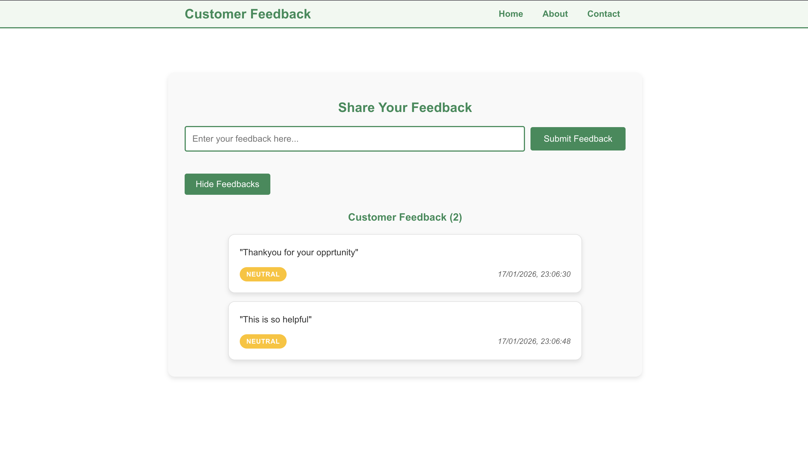

<h1 align="center">Customer Feedback Categorization System</h1>


## Overview

The Customer Feedback Categorization System allows users to submit feedback and automatically categorizes it based on predefined business rules.  
Submitted feedback can be viewed through a structured user interface.

---
##  Run Instructions

### Backend  (ASP.NET Core)
1. Open terminal and go to backend folder:

   - cd backend/CustomerFeedback.API
   - dotnet run
  
### Frontend (React)
  - npm install
  - npm start

----


## Architecture Explanation (4-Tier Structure)

This project follows a clean **4-tier architecture** to ensure separation of concerns, maintainability, and scalability.

### 1. API Layer
- Handles all HTTP requests and responses
- Contains only controllers
- Responsible for request validation and response formatting
- Does **not** contain business logic
- Communicates with the Application layer via dependency injection

### 2. Application Layer
- Contains application-level business logic
- Defines DTOs (Data Transfer Objects)
- Exposes service abstractions and interfaces
- Coordinates interactions between API and Domain layers
- Acts as a mediator between UI concerns and core business rules

### 3. Domain Layer
- Represents the core of the system
- Contains domain entities and enums
- Implements feedback categorization rules
- Free from framework and infrastructure dependencies
- Encapsulates business rules that remain stable over time

### 4. Infrastructure Layer
- Implements data persistence and external integrations
- Provides concrete implementations of repository interfaces
- Supports:
  - In-memory storage (used for local development and testing)
  - Cosmos DB repository (optional / conceptual for future persistence)
- Can be swapped without affecting other layers

---

# Business Logic / Categorization Rules

The system categorizes feedback into:
- Complaint
- Praise
- Suggestion
- Other

Rules are defined in the **Domain Layer** so business logic is independent of frameworks.

---

### Async Operation

Using async operations prevents the UI from freezing while waiting for the server.  
It also prepares the app for future improvements like background jobs or long-running tasks.

---

### Cosmos DB 

Cosmos DB is a globally distributed, fully managed NoSQL database service by Azure.  
It supports multiple APIs such as SQL, MongoDB, Cassandra, etc., and is ideal for scalable cloud applications.

In this project, I **did not fully integrate Cosmos DB** because I couldn’t create an Azure student account using my university ID (tried multiple times).  
However, I prepared the project structure and repository class to support Cosmos DB in the future.

**How I would integrate Cosmos DB**
1. Create an Azure Cosmos DB account in the Azure Portal.
2. Choose the SQL API.
3. Create a database and container (e.g., `FeedbackDB`, `FeedbackContainer`).
4. Add Cosmos DB connection settings in `appsettings.json`.
5. Implement `CosmosFeedbackRepository` using `CosmosClient`.
6. Register the repository in DI in `Program.cs`.
7. Replace In-Memory repository with Cosmos repository.

**Benefits**
- **Highly scalable** for large data volumes.
- **Low latency** globally with automatic replication.
- **Schema-less** data storage, ideal for flexible feedback data.
- **Easy to scale** without major changes to the application.

---

### Mediator Pattern

The Mediator Pattern is used to decouple the controller from business logic by introducing a central mediator that handles requests and responses.  
In this project, I **did not implement MediatR**, but the design is prepared for it. If MediatR were used, the controller would only send a request to the mediator and receive a response, while all business logic would be handled in separate handler classes.

**Benefits**
- **Reduces coupling:** Controllers don’t directly call services or business logic, making the system easier to change.
- **Improves maintainability:** Adding new features only requires creating new request/handler pairs, without modifying controllers.
- **Supports clean architecture:** Keeps API layer thin and business logic inside application/domain layers.
- **Better testability:** Handlers can be unit tested independently from controllers.
- **Clear separation of concerns:** Controllers only manage HTTP requests, while handlers manage business rules.

---

### Azure 

This section explains how I would deploy the project using **Azure App Service** and **Azure Pipelines** (CI/CD).  
I did not deploy it practically due to Azure account limitations, but the setup is ready conceptually.

---

## Azure App Service (Conceptual)

1. Create a new **Azure App Service** in the Azure portal.
2. Choose **.NET 9 runtime** for the backend API.
3. Configure **App Settings** (if any environment variables are needed).
4. Enable **CORS** to allow requests from the React frontend domain.
5. Deploy the backend API code to the App Service.

**Benefits**
- Managed hosting for ASP.NET Core applications
- Easy scaling and monitoring
- Supports automatic deployments from GitHub or Azure DevOps

---

## Azure Pipelines (CI/CD) (Conceptual)

1. Create an **Azure DevOps** project.
2. Create a new pipeline using YAML.
3. Configure pipeline to:
   - Build backend project
   - Build frontend project
   - Run tests (if available)
   - Publish build artifacts
   - Deploy backend to Azure App Service

**Pipeline Flow**
- **Build Stage**  
  Builds backend and frontend
- **Test Stage** (optional)  
  Runs unit tests
- **Deploy Stage**  
  Deploys the backend API to Azure App Service

**Benefits**
- Automated deployments on every push
- Ensures consistent build process
- Reduces manual deployment errors
- Supports rollback and versioning

---

## Project Structure

### Backend

```text
backend/
├── CustomerFeedback.API
│   ├── Controllers
│   │   └── FeedbackController.cs
│   ├── Properties
│   ├── Program.cs
│   ├── appsettings.json
│   └── CustomerFeedback.API.csproj
│
├── CustomerFeedback.Application
│   ├── DTOs
│   │   ├── CreateFeedbackDto.cs
│   │   └── FeedbackResponseDto.cs
│   ├── Interfaces
│   │   └── IFeedbackRepository.cs
│   └── Services
│
├── CustomerFeedback.Domain
│   ├── Entities
│   │   └── Feedback.cs
│   ├── Enums
│   │   └── FeedbackCategory.cs
│   └── Rules
│       └── FeedbackCategorizationRules.cs
│
├── CustomerFeedback.Infrastructure
│   └── Persistence
│       ├── InMemory
│       │   └── InMemoryFeedbackRepository.cs
│       └── CosmosDb
│           └── CosmosFeedbackRepository.cs
│
└── CustomerFeedback.sln


frontend/
├── src
│   ├── api
│   │   └── feedbackApi.ts
│   ├── components
│   │   ├── FeedbackForm.tsx
│   │   ├── FeedbackList.tsx
│   │   └── NavBar.tsx
│   ├── pages
│   │   └── Home.tsx
│   ├── types
│   │   └── Feedback.ts
│   ├── App.tsx
│   └── index.tsx
├── package.json
└── tsconfig.json

```
--- 

### Screenshot
<p align="center">  </p> 
